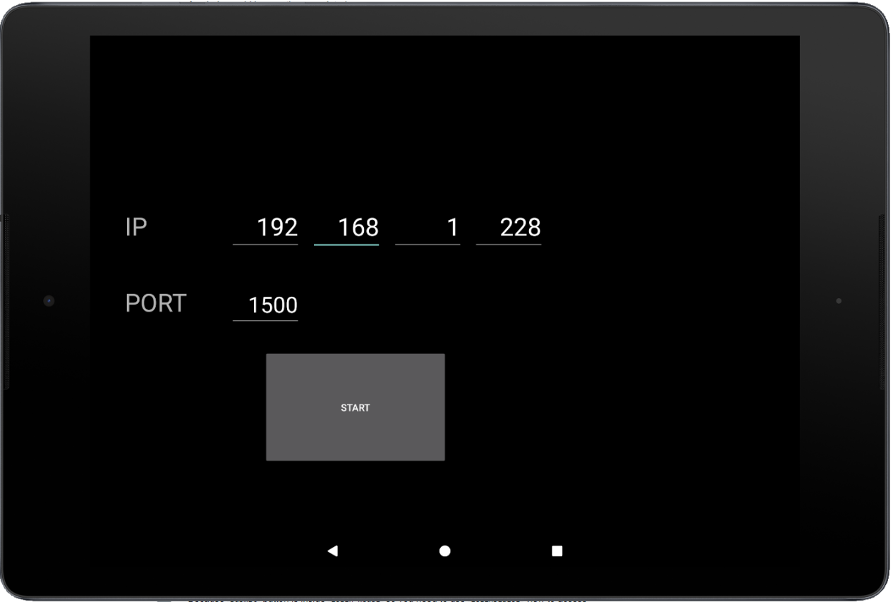
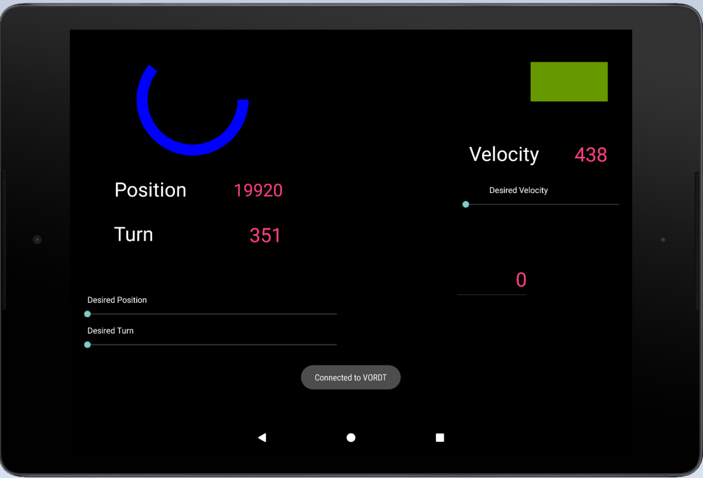

# Android Java Branch
## Debugging App V1.0
### Summary

If you are able to simulate your hardware design, you are in the right path. If you can synthesize your RTL then you have reached a big milestone. However, this is just the beginning, real work starts once you burn your design into FPGA. 

Everything works in theory, but you need to face the reality !

Debugging phase starts and somehow you need to see the incoming/outgoing data from the chip. 

Easiest way to do this is 7-segment displays or onboard LEDs. These are the fastest way to get feedback. Project already has these but what if you need 1000 screens ? 

Then, you try serial protocols to communicate, but then you will need a computer screen to read it. You will need to carry the computer and it needs to be attached to the FPGA all the time. 

Another alternative is lcd screens and custom drivers. Average screen-module has 500 page datasheet. If you have time, then go for it ! have fun writing spi/i2c/8bit-parallel (whatever!) driver and draw your data.

In this project, esp32 was used and it already talks to the FPGA. I decided to add a tablet and then android app journey started ...

### Architecture

add diagram here.

### Layout

### Screenshots

Main Page

Interface Page

### Future

For now it's a debugging app and I have a plan to change its purpose in the future. Once FPGA implementation is done, project will move it to higher level phase where I will develop a new app to control the robot. 
