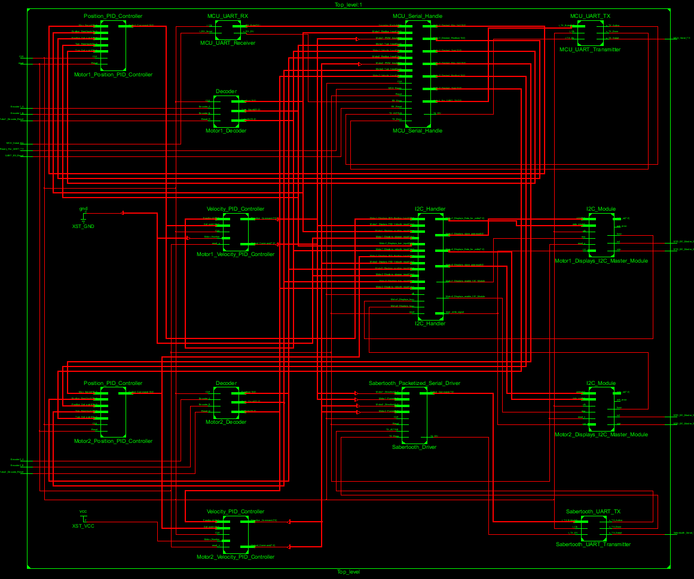

# FPGA 
### TODO
* ~~I2C_Slave module can't read 8th bit. Fix timing and listen_buffer.(this bug actually fixed by changing the edge detection in listen_state, under state machine)~~

* **Sometimes I2C line goes limbo. Take a look at the TI's debugging manual. I assume problem is something to do with capacitance because resistors values and voltage across I2C slaves seem good.

* ~~Decoder outputs huge random when you reach 0 as velocity setpoint. its because two's comp and average translation error. Fix the average_velocity block in decoder.vhd.~~

  ~~1) State machine checks the velocity so fast that changing direction causes unexpected sum of velocities.~~
  ~~2) think about implementing a case where array refreshes itself when direction changes~~
  3) Eventhough DC motor can't finish one turn in 1/125(8ms), try to implement a stack or register for over-flow protection.(ignored)

* ~~PID_Velocity can't do reverse. ---Fix decoder.vhd first---~~

* ~~Adjust PID_Velocity gains or implement a logic to handle direction changes.~~ 

  ~~1) For instance, changing velocity from -15 to 15 is slow where -55 to 55 is fast. This should be vise versa.~~
  ~~2) Another problem is pid's output, can't go down to 0. This sometimes causes a major problem. Imagine you are going at +15 and decided to stop, if state machine can't output 0, robot will not stop.~~
  3) For the ultimate goal some kind of neural net or adaptive control loop can be implemented.(ignored)
   Some AI into PID references;
  [Reference 1](http://ieeexplore.ieee.org/document/6186962/), [Reference 2](https://www.sciencedirect.com/science/article/pii/S2405896316304116), [Reference 3](https://www.researchgate.net/profile/Mohamed_Moustafa_Hassan/publication/296077413_Tuning_PID_Controllers_Using_Artificial_Intelligence_Techniques_Applied_to_DC-Motor_and_AVR_System/links/5721b53808ae82260fab48bf/Tuning-PID-Controllers-Using-Artificial-Intelligence-Techniques-Applied-to-DC-Motor-and-AVR-System.pdf)

* ~~Implement Position_PID module~~

* ~~Adjust PID gains for position accuracy~~

* ~~Move from debugging one packet to multiple incoming I2C packets.~~

* ~~Test maximum I2C speed ESP32 can handle. If not enough switch it to SPI ?~~ (decided to go with UART)

* Test UART Serial handle
 

### RTL

